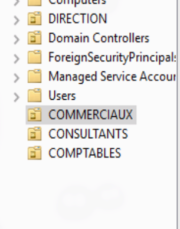
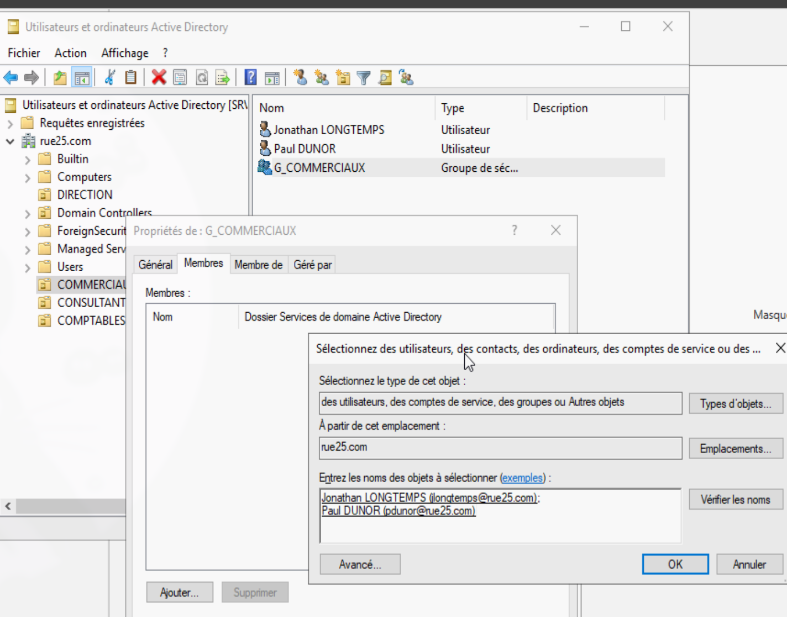
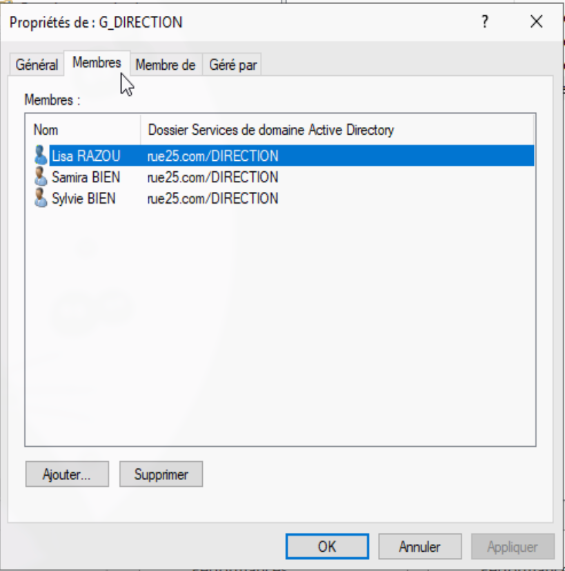
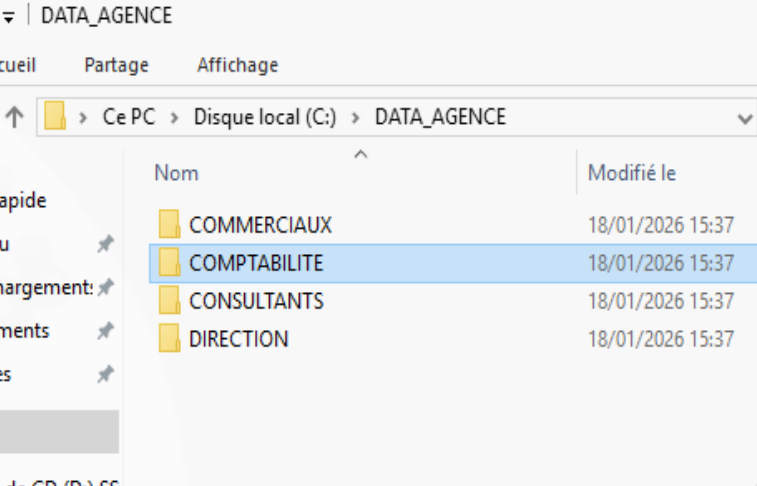
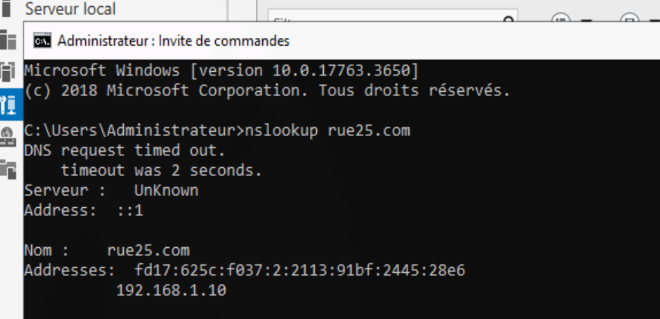

# Brief partie 3

## Overview 
|Data | Value |
|--------|------|
| Nom du serveur | SRV-AD-RUE25 |
| Système d'exploitation | Windows Server 2019 Desktop |
| Domaine Active Directory | rue25.com |
| Plage DHCP |  192.168.1.50 - 192.168.1.100 |

## Graph

graph TD
    %% Le Domaine
    Domaine((rue25.com))
    
    %% Les Unités d'Organisation
    OU_DIR[OU Direction]
    OU_COM[OU Commercial]
    OU_IMM[OU Immobilier]
    OU_CPTA[OU Comptabilité]

    %% Les Groupes de sécurité
    G_DIR[G_DIRECTION]
    G_COM[G_COMMERCIAL]
    G_IMM[G_IMMOBILIER]
    G_CPTA[G_COMPTABLES]

    %% Liens Domaine -> OU
    Domaine --- OU_DIR
    Domaine --- OU_COM
    Domaine --- OU_IMM
    Domaine --- OU_CPTA

    %% Liens OU -> Groupes
    OU_DIR --- G_DIR
    OU_COM --- G_COM
    OU_IMM --- G_IMM
    OU_CPTA --- G_CPTA

    %% Exemple d'utilisateurs (facultatif pour la lisibilité)
    G_DIR -.-> Samira[Samira BIEN]
    G_CPTA -.-> Vincent[Vincent TYME]

    %% Style pour différencier les types d'objets
    style Domaine fill:#f96,stroke:#333,stroke-width:2px
    style G_DIR fill:#dfd,stroke:#333
    style G_COM fill:#dfd,stroke:#333
    style G_IMM fill:#dfd,stroke:#333
    style G_CPTA fill:#dfd,stroke:#333

## Préparation de l'environnement 

Préparer une machine virtuelle avec Virtual Box. Configuration des  ressources virtuelles.
4096 MB de RAM et 2 CPU Cores avec 50Gb d'espace disque. Devrait suffire largement sans priver l'OS principal de ressources.

La première tentative de boot de l'OS échoue avec une erreur de contrat de licence invalide. 
Résolution: Ouvrir les paramètres de la VM, puis onglet "Système" et confirmer que la configuration des ressources a bien été enregistrée.
Puis onglet "Stockage", supprimer le "unattended setup" avec l'icône de disquette et relancer.

Sélectionner le type de serveur à installer. Choisir l'environnement desktop.

Pour la gestion des accès, configuration d'un mot de passe complexe pour le compte Administrateur. Dans une infrastructure plus large, on pourrait centraliser la gestion des identités avec une solution comme Authentik ou des solutions professionnelles comme CyberArk pour sécuriser les comptes à hauts privilèges.

Au démarrage de l'OS, autoriser la découverte réseau.

Réalisation d'une première snapshot post-installation avec une base d'OS fonctionnel  sans aucune autre action importante réalisée. Permet de revenir à un état propre en cas de problème ou de dupliquer l'OS pour une autre utilité ou configuration tout en garantissant l'homogénéité de la configuration appliquée.

### Début de la configuration du serveur
Renommer le serveur en SRV-AD-RUE25

Configuration du panel IPv4, définition de l'IP, masque, passerelle et DNS par défaut. Définir une IP fixe permet de garantir la pérennité de l'accès au serveur.

| IP | Passerelle | DNS |
|----|------------|-----|
|192.168.1.10|192.168.1.1|127.0.0.1|

Ajouter ensuite les fonctionnalités ADDS et DHCP que l'on trouve dans le tableau de bord du serveur, dans Ajout de rôles et de fonctionnalités.
Cocher l'option de reboot pour garantir une installation propre et achevée avant de continuer.

Installation réussie.

### Configurer l'ADDS

Configurer le nom de domaine comme indiqué dans le brief client, rue25.com.

Configurer les options, ajouter le mot de passe. Serveur 2016 par défaut pour la rétrocompatibilité avec du matériel plus ancien.

L’avertissement concernant l’absence de délégation DNS peut être ignoré dans ce contexte, le serveur configuré étant le serveur DNS principal du domaine.

Nom par défaut, rempli automatiquement par l'utilitaire.

La page de vérification de la configuration permet de s'assurer de la bonne configuration avant de procéder à l'écriture de cette dernière. Lorsque la configuration est confirmée, cliquer sur "Installer".

En cas d'installation réussie, lors du prochain démarrage le préfixe RUE25\ devrait apparaître comme illustré ci-dessus.

### Configuration du service DHCP

Depuis le Gestionnaire de serveur, commencer la configuration du serveur DHCP. 
Créer une nouvelle étendue IPv4

Définir une plage de 192.168.1.50 jusque 192.168.1.100.
Cette plage laisse la possibilité d'agrandir le parc informatique tout en conservant des adresses IP disponibles pour des appareils dont la configuration est statique, tels que les deux imprimantes demandées.

Saisir l'adresse IP du routeur : 192.168.1.1 dans ce contexte.

Vérifier que le nom de domaine s'est bien propagé et qu'on retrouve l'ip du serveur.

Laisser la page de configuration Server WINS vide.
Activer l'étendue qu'on vient de configurer.

### Gestion de l'annuaire (utilisateurs, groupes, OU)
Ensuite, créer la structure par service :

Une fois les 4 unités d'organisation créées, créer les utilisateurs :

Profil 1

Définir un mot de passe.
Le changement de mot de passe à la prochaine ouverture a volontairement été décoché et la non expiration du mot de passe a été coché dans le cadre de l'exercice.
Dans un contexte de production, un changement de mot de passe à la première ouverture de session serait recommandé afin d’améliorer la sécurité.

Une collision de nom de connexion est détectée entre deux utilisateurs partageant les mêmes initiales.
Dans le cadre de cet exercice, le nom de connexion de l’un des comptes est modifié par l’ajout d’un caractère afin d’éviter le conflit.

D’autres conventions de nommage peuvent être mises en place afin de limiter les collisions, telles que l’utilisation du prénom et du nom complets ou l’ajout d’un suffixe numérique.
Dans des environnements de plus grande taille, une modification globale de la nomenclature peut s’avérer complexe à mettre en œuvre une fois la production démarrée.

Ajouter les utilisateurs à leurs groupes de sécurité respectifs:

Une fois terminé, vérifier que les utilisateurs appartiennent bien à leur groupe.

### Création et sécurisation des dossiers partagés
Créer une arborescence dédiée aux dossiers partagés par service.

### Configuration du partage par groupe
Retirer "Tout le monde" des propriété du partage. Ajouter le(s) groupe(s) correspondant(s).

Reproduire la même procédure dans l'onglet sécurité. Désactiver l'héritage pour définir les droits d'accès et de lecture par groupe.

Supprimer la ligne "Utilisateurs" ou lui retirer l'intégralité de ses droits pour ne pas avoir de fuite d'accès.

Le dossier partagé comptabilité est donc accessible en lecture/écriture pour le groupe G_COMPTABLES, lisible par le groupe G_DIRECTION, et inaccessible pour les autres. On protégère ainsi les fichiers d'une mauvaise écriture par un service non concerné et on empêche la lecture de documents sensibles par des personnes non concernées. Application du principe de Least Privilege. 

Reproduire la même procédure pour les autres dossiers partagés.

Redémarrer une dernière fois pour s'assurer de l'enregistrement et de l'application de toutes les modifications réalisées.

### Quelques tests de validation
Vérification finale : taper dans un terminal nslookup rue25.com pour vérifier si la configuration a tenu. 

La configuration est bonne.

Puis vérifier les utilisateurs :

Ils sont tous bien présents.
Le brief partie 3 se conclut ainsi.

### Conclusion

L'infrastructure Rue25 est désormais opérationnelle, segmentée au niveau des droits d'accès et prête pour l'intégration des postes clients.
