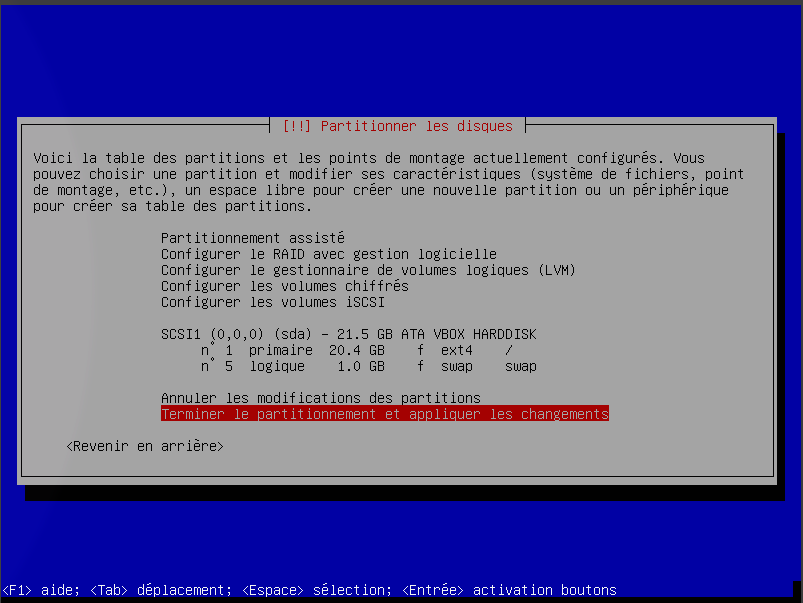
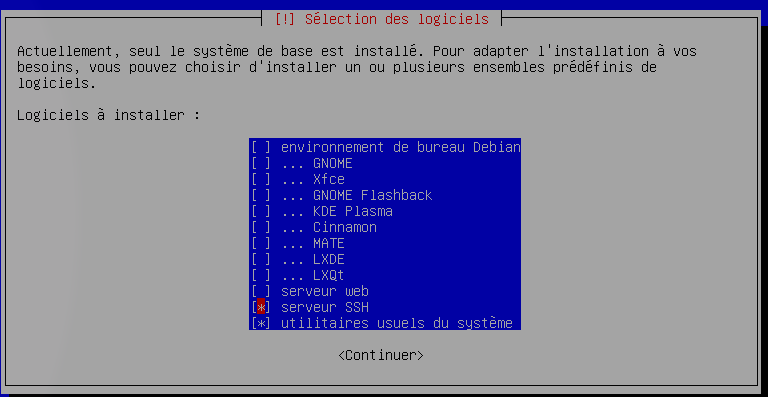
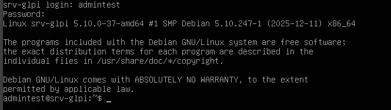
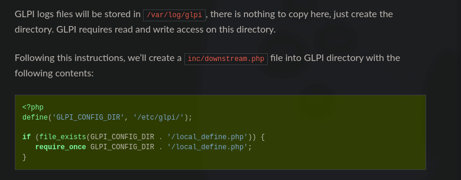
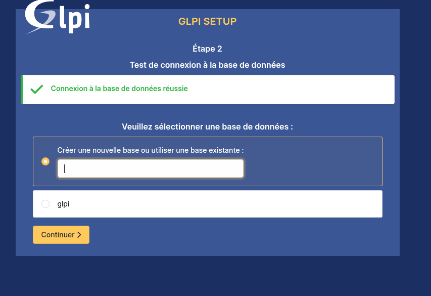
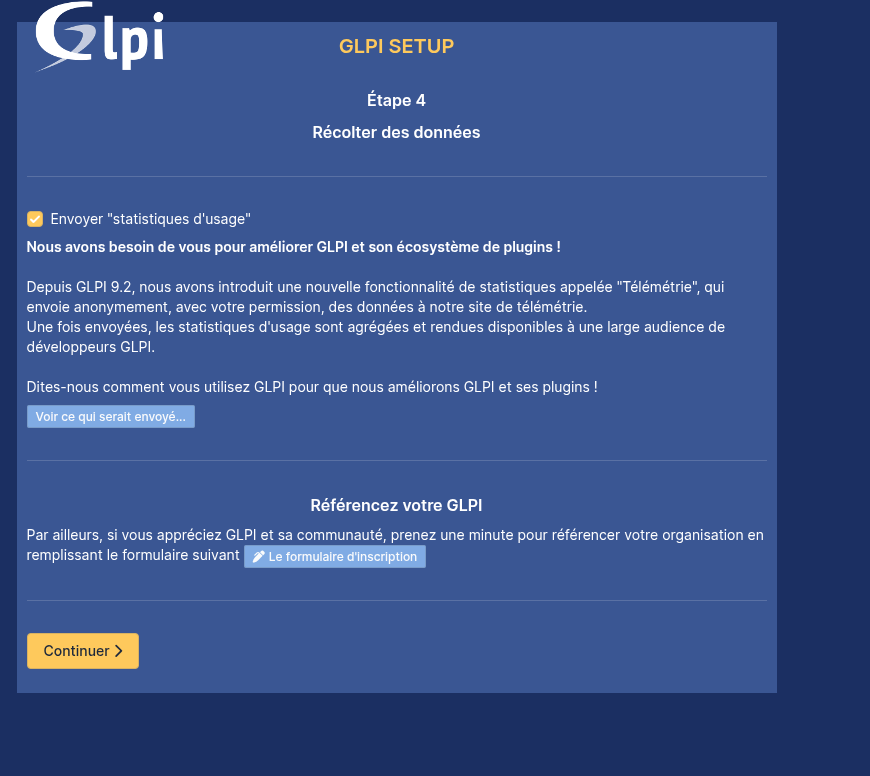
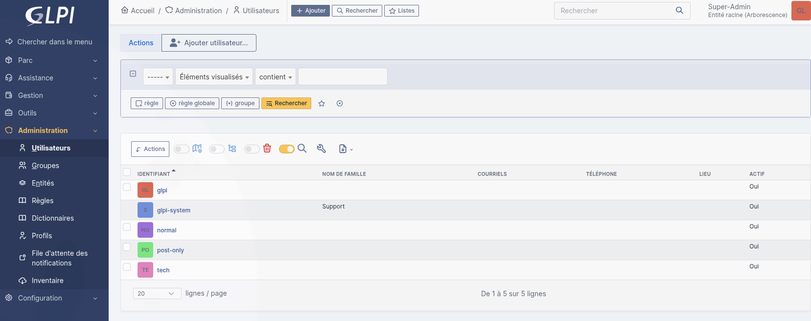
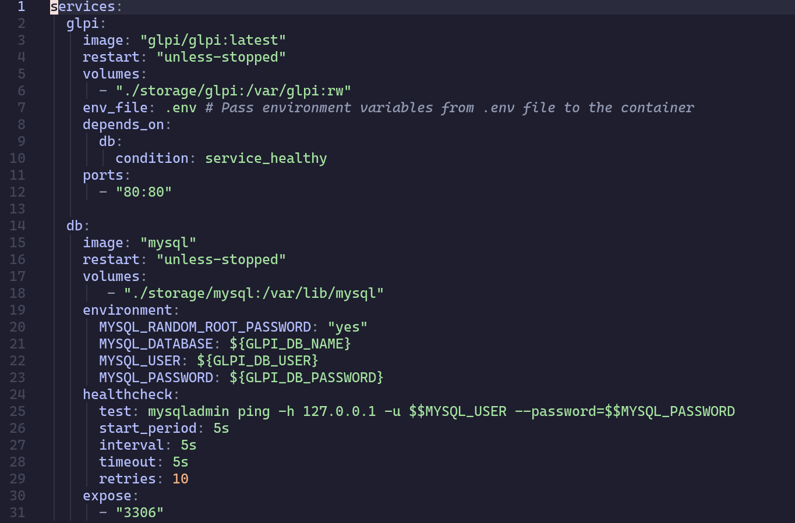

# Brief partie 4


# Simplon - WildCodeSchool - Test positionnement
20260119
### Brief part 4

Créer une VM en Debian 11.6. 
|CPU|RAM|Stockage|
----|---|---------
|1|2 Go|20 Go|

Définir le nom sur srv-glpi et du domaine sur rue25.com.


Après création du compte admin, créer la partition disque.


On décoche la DE pour partir en Headless et on active SSH conformément aux consignes du brief et afin d’éviter une reconfiguration post-installation.


L'os démarre après l'utilitaire d'installation.


Vérifier si SSH s'est mis en marche correctement, cela permet de poursuivre le travail depuis un poste remote.


SSH fonctionnel, prouvé par la possibilité de s'y connecter depuis un autre PC.


Installer sudo via su- puis ajouter l'utilisateur au groupe sudo. Nécessaire pour l'installation des paquets.
Ensuite se référer à la documentation officielle de GLPI ici :
https://glpi-install.readthedocs.io/en/latest/prerequisites.html et https://glpi-install.readthedocs.io/en/latest/install/index.html


Tout d'abord, installer les paquets  nécessaires :
```bash
sudo apt install apache2 mariadb-server php php-mysql php-ldap php-xml php-gd php-mbstring php-curl php-intl php-zip php-bz2
```


```bash
sudo mariadb
CREATE DATABASE glpi CHARACTER SET utf8mb4 COLLATE utf8mb4_unicode_ci;
CREATE USER 'glpi_admin'@'localhost' IDENTIFIED BY 'unmotdepassetresfort';
GRANT ALL PRIVILEGES ON glpi.* TO 'glpi_admin'@'localhost';
FLUSH PRIVILEGES;
EXIT;
```

On créér la base de données avec une utilisateur dédié pour être rootless.
Ensuite téléchargement de l'archive avec 

```bash
wget  https://github.com/glpi-project/glpi/releases/download/10.0.12/glpi-10.0.12.tgz
```

Petit détour par man tar pour identifier la bonne commande d'extraction puis
```bash
tar -xvzf glpi-10.0.12.tgz 
```


Déplacement du fichier : 
```bash
sudo mv glpi /var/www/glpi
```

On donne les permissions récursives:
```bash
sudo chown -R www-data:www-data /var/www/glpi sudo chmod -R 755 /var/www/glpi
```

Création du fichier downstream

admintest@srv-glpi:/tmp$ sudo cp -rp /var/www/glpi/config /etc/glpi/
admintest@srv-glpi:/tmp$ sudo cp -rp /var/www/glpi/files /var/lib/glpi/files/
admintest@srv-glpi:/tmp$ sudo nano /var/www/glpi/inc/downstream.php

Dorénavant l'interface web est accessible à l'adresse 
http://192.168.1.12/glpi/install/install.php


On accepte les ToS.
On choisit "Installer"
L'utilitaire signale plusieurs problèmes à corriger, ce qu'on va faire :

Un avertissement concernant la version de PHP est signalé. Le choix a été fait de conserver la version fournie par Debian afin de bénéficier des correctifs de sécurité du dépôt officiel. Ce choix est considéré compatible avec le bon fonctionnement de GLPI dans ce contexte.

On remplit ensuite le formulaire de connexion avec les infos qu'on a placé dans la commande plus tôt
La connexion a réussi

On sélectionne la db qu'on a déjà créé, glpi
Formulaire concernant la récolte des données



Test de connexion avec le compte admin:

Réussi, on a bien tous les comptés créés par défaut :

A ce stade, il reste à créer les vrais comptes, bloquer, modifier ou supprimer les comptes par défaut inutilisés pour ne pas avoir de faille évidente. Supprimer les fichiers d'installation qui ont été utilisés pour garder un environnement propre pour se simplifier la vie lors de potentiels diagnostiques futurs et être sûr de ne pas laisser la possibilité de déclencher une installation malencontreuse et casser celle en place.

Petite note bonus, selon l'environnement, je sais qu'il existe une version Docker de GLPI qui pourrait s'avérer ou non pertinnente. Le docker-compose.yaml ressemblerait à :


Source :
https://help.glpi-project.org/tutorials/fr/procedures/running_glpi_on_docker
Il suffirait alors de créer le fichier .env, adapter les bind mounts et ajouter un service pour un reverse proxy (nginx par exemple) ou ajouter un tunnel Cloudflared pour bénéficier des protections de Cloudflared.
